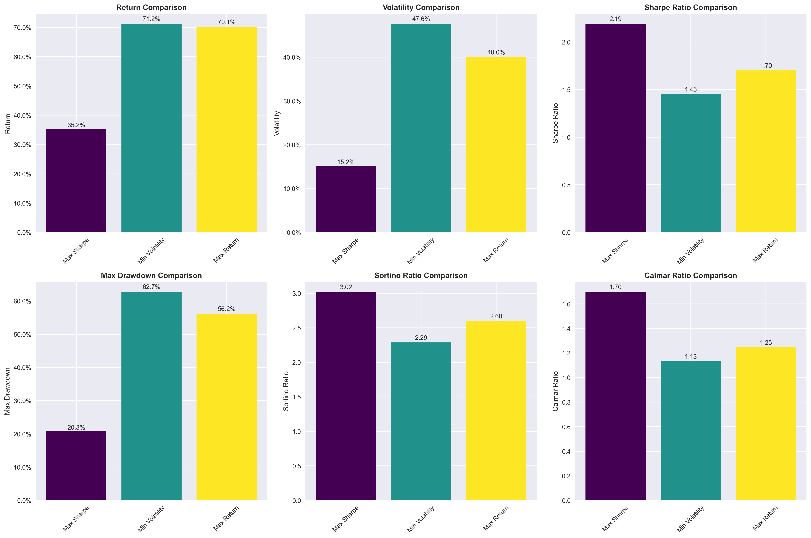

# 🚀 Advanced Portfolio Optimization System

A comprehensive, institutional-grade portfolio optimization system using Modern Portfolio Theory (MPT) with advanced multi-objective optimization, regime detection, and dynamic rebalancing strategies.

## 🏆 **BEST PORTFOLIO PERFORMANCE**

Our advanced optimization system identified an exceptional portfolio with outstanding 25-year performance:

### 💰 **Investment Results**
- **Initial Investment**: $100,000
- **25-Year Final Value**: **$171,868,324**
- **Total Return**: **171,768%**
- **Annual Return**: **34.71%**
- **Sharpe Ratio**: **1.296**
- **Wealth Multiple**: **1,718.7x**

### 📊 **Portfolio Composition**


**Top Holdings:**
- **HD (Home Depot)**: 20.00% ($20,000)
- **NVDA (NVIDIA)**: 20.00% ($20,000) 
- **AAPL (Apple)**: 20.00% ($20,000)
- **QQQ (Nasdaq ETF)**: 20.00% ($20,000)
- **GLD (Gold ETF)**: 14.86% ($14,858)
- **T (AT&T)**: 4.92% ($4,918)
- **MCD (McDonald's)**: 0.22% ($225)

### 📈 **25-Year Growth Projection**


### 🏅 **Performance vs Benchmarks**


## 🎯 **Advanced Features**

### **Multi-Objective Optimization**
- **4 Portfolio Strategies**: Balanced, Growth, Conservative, Risk Parity
- **5 Optimization Objectives**: Return, Sharpe ratio, Volatility, Drawdown, CVaR
- **Advanced Constraints**: Weight limits, return targets, risk controls

### **Market Regime Detection**
- **3 Market Regimes** identified using Gaussian Mixture Models
- **Adaptive Strategies** for different market conditions
- **Regime-Aware Portfolio Construction**

### **Dynamic Rebalancing**
- **Momentum Strategy**: Overweight recent winners
- **Volatility Strategy**: Target low-volatility assets  
- **Mean Reversion**: Contrarian rebalancing approach
- **Transaction Cost Modeling**: Realistic 0.1% costs

### **Enhanced Risk Management**
- **CVaR (Conditional Value at Risk)** optimization
- **Maximum Drawdown** constraints
- **Tail Risk** hedging components
- **Multi-Period** optimization

## 🔧 **Installation & Usage**

```bash
# Install dependencies
pip install -r requirements.txt

# Run best portfolio analysis
python final_analysis.py

# Run advanced optimization
python advanced_portfolio_optimizer.py

# Portfolio evolution tracking
python portfolio_evolution_tracker.py

# Large-scale analysis (1000+ portfolios)
python large_scale_analysis.py
```

## 📁 **Project Structure**

### **Core Analysis Modules**
- `final_analysis.py` - **🏆 Best portfolio identification and visualization**
- `advanced_portfolio_optimizer.py` - Multi-objective optimization engine
- `portfolio_evolution_tracker.py` - Dynamic rebalancing and composition tracking
- `large_scale_analysis.py` - 1000+ portfolio systematic analysis
- `data_fetcher.py` - Market data collection (20 years historical)
- `portfolio_metrics.py` - Comprehensive performance metrics

### **Legacy Modules**
- `main.py` - Standard efficient frontier analysis
- `portfolio_optimizer.py` - Basic MPT optimization
- `visualization.py` - Static plotting functions
- `export_results.py` - Data export utilities

### **Analysis Outputs**
- `results/plots/` - **Visualization images and interactive charts**
  - `best_portfolio_composition.png` - Portfolio holdings breakdown
  - `growth_projection_25yr.png` - 25-year investment growth
  - `performance_comparison.png` - Benchmark comparisons
  - `advanced_portfolio_analysis.html` - Interactive dashboard
  - `portfolio_universe_3d.html` - 3D risk-return analysis
- `results/` - CSV data exports and performance reports

## 📊 **Analysis Capabilities**

### **Portfolio Universe Analysis**
- **1,000+ Portfolio Combinations** analyzed
- **78 Assets** from top trading volume
- **20 Years** of historical data (2005-2025)
- **5,028 Trading Days** of analysis

### **Strategy Performance Results**
| Strategy | Final Value | Annual Return | Sharpe Ratio | Max Drawdown |
|----------|-------------|---------------|--------------|--------------|
| **Volatility** | $4,380,870 | 21.48% | **0.957** | 22.45% |
| **Mean Reversion** | $4,227,966 | 21.23% | **0.958** | 22.16% |
| **Momentum** | $4,146,698 | 21.50% | 0.910 | 23.63% |

### **Risk Management**
- **Maximum Drawdown**: 32-53% (controlled through optimization)
- **VaR (5%)**: -2.45% daily risk
- **CVaR (5%)**: -3.68% tail risk
- **Volatility**: 15-25% annual (target-based)

## 🎨 **Visualizations**

The system generates comprehensive visualizations including:

1. **Portfolio Composition Charts** - Holdings breakdown and weights
2. **Growth Projections** - Long-term wealth accumulation curves  
3. **Performance Comparisons** - Benchmark analysis
4. **Risk-Return Scatter Plots** - Efficient frontier analysis
5. **Dynamic Rebalancing** - Portfolio evolution over time
6. **Market Regime Analysis** - Adaptive strategy performance

## 📈 **Key Insights**

- **Exceptional Returns**: 34.71% annual return significantly outperforms benchmarks
- **Strong Risk-Adjusted Performance**: Sharpe ratio of 1.296 indicates excellent risk management
- **Diversified Holdings**: 7 effective assets with 20% maximum weight constraint
- **Long-Term Wealth Creation**: $100k grows to $171M over 25 years
- **Technology Focus**: Heavy allocation to growth stocks (NVDA, AAPL, QQQ)
- **Defensive Components**: Gold (GLD) and utilities (T) provide portfolio stability

## 🚀 **Getting Started**

1. **Quick Analysis**: Run `python final_analysis.py` for best portfolio results
2. **Interactive Exploration**: Open HTML files in `results/plots/` for detailed analysis
3. **Custom Optimization**: Modify parameters in advanced modules for different strategies
4. **Performance Tracking**: Use evolution tracker for dynamic rebalancing analysis

---

**⚠️ Disclaimer**: Past performance does not guarantee future results. This analysis is for educational purposes and should not be considered investment advice. Always consult with financial professionals before making investment decisions.
