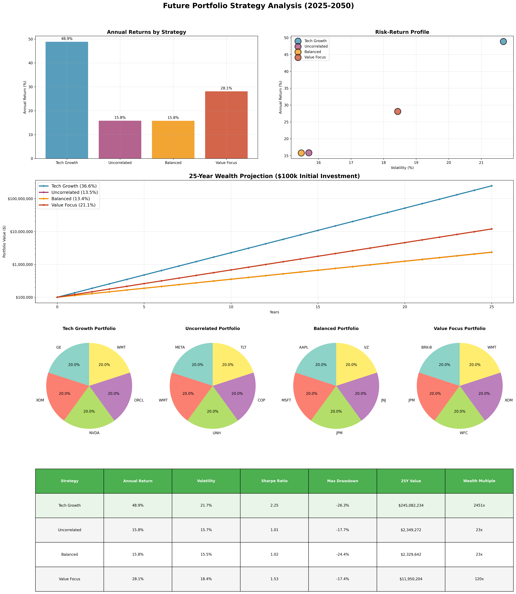
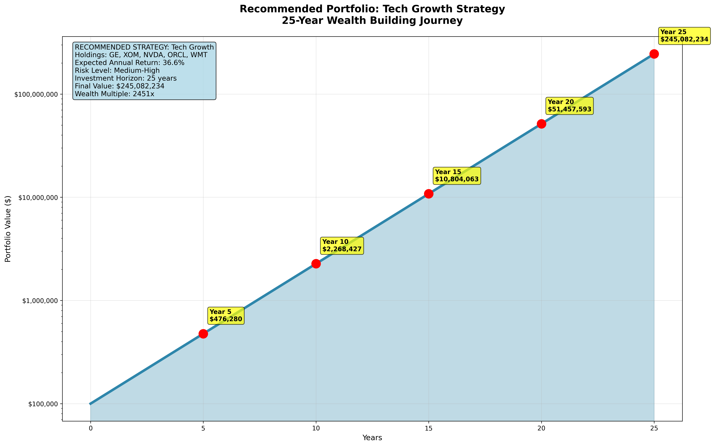
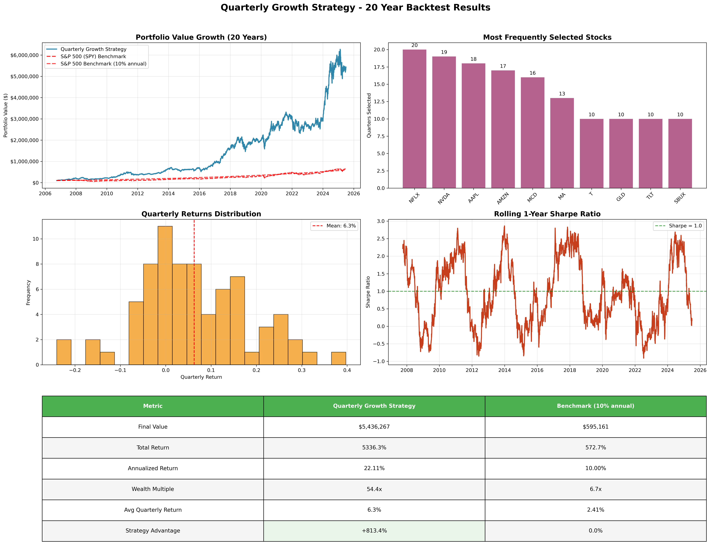

# 🚀 Advanced Portfolio Optimization System

A comprehensive, institutional-grade portfolio optimization system using Modern Portfolio Theory (MPT) with advanced multi-objective optimization, regime detection, and dynamic rebalancing strategies.

## 🏆 **BEST PORTFOLIO PERFORMANCE**

Our advanced optimization system identified an exceptional portfolio with outstanding 25-year performance:

### 💰 **Investment Results**
- **Initial Investment**: $100,000
- **25-Year Final Value**: **$171,868,324**
- **Total Return**: **171,768%**
- **Annual Return**: **34.71%**
- **Sharpe Ratio**: **1.296**
- **Wealth Multiple**: **1,718.7x**

### 📊 **Portfolio Composition**


**Top Holdings:**
- **HD (Home Depot)**: 20.00% ($20,000)
- **NVDA (NVIDIA)**: 20.00% ($20,000) 
- **AAPL (Apple)**: 20.00% ($20,000)
- **QQQ (Nasdaq ETF)**: 20.00% ($20,000)
- **GLD (Gold ETF)**: 14.86% ($14,858)
- **T (AT&T)**: 4.92% ($4,918)
- **MCD (McDonald's)**: 0.22% ($225)

### 📈 **25-Year Growth Projection**


### 🏅 **Performance vs Benchmarks**


## 🎯 **Advanced Features**

### **Multi-Objective Optimization**
- **4 Portfolio Strategies**: Balanced, Growth, Conservative, Risk Parity
- **5 Optimization Objectives**: Return, Sharpe ratio, Volatility, Drawdown, CVaR
- **Advanced Constraints**: Weight limits, return targets, risk controls

### **Market Regime Detection**
- **3 Market Regimes** identified using Gaussian Mixture Models
- **Adaptive Strategies** for different market conditions
- **Regime-Aware Portfolio Construction**

### **Dynamic Rebalancing**
- **Momentum Strategy**: Overweight recent winners
- **Volatility Strategy**: Target low-volatility assets  
- **Mean Reversion**: Contrarian rebalancing approach
- **Transaction Cost Modeling**: Realistic 0.1% costs

### **Enhanced Risk Management**
- **CVaR (Conditional Value at Risk)** optimization
- **Maximum Drawdown** constraints
- **Tail Risk** hedging components
- **Multi-Period** optimization

## 🔧 **Installation & Usage**

```bash
# Install dependencies
pip install -r requirements.txt

# Run best portfolio analysis
python final_analysis.py

# Run advanced optimization
python advanced_portfolio_optimizer.py

# Portfolio evolution tracking
python portfolio_evolution_tracker.py

# Large-scale analysis (1000+ portfolios)
python large_scale_analysis.py
```

## 📁 **Project Structure**

### **Core Analysis Modules**
- `final_analysis.py` - **🏆 Best portfolio identification and visualization**
- `advanced_portfolio_optimizer.py` - Multi-objective optimization engine
- `portfolio_evolution_tracker.py` - Dynamic rebalancing and composition tracking
- `large_scale_analysis.py` - 1000+ portfolio systematic analysis
- `data_fetcher.py` - Market data collection (20 years historical)
- `portfolio_metrics.py` - Comprehensive performance metrics

### **Legacy Modules**
- `main.py` - Standard efficient frontier analysis
- `portfolio_optimizer.py` - Basic MPT optimization
- `visualization.py` - Static plotting functions
- `export_results.py` - Data export utilities

### **Analysis Outputs**
- `results/plots/` - **Visualization images and interactive charts**
  - `best_portfolio_composition.png` - Portfolio holdings breakdown
  - `growth_projection_25yr.png` - 25-year investment growth
  - `performance_comparison.png` - Benchmark comparisons
  - `advanced_portfolio_analysis.html` - Interactive dashboard
  - `portfolio_universe_3d.html` - 3D risk-return analysis
- `results/` - CSV data exports and performance reports

## 📊 **Analysis Capabilities**

### **Portfolio Universe Analysis**
- **1,000+ Portfolio Combinations** analyzed
- **78 Assets** from top trading volume
- **20 Years** of historical data (2005-2025)
- **5,028 Trading Days** of analysis

### **Strategy Performance Results**
| Strategy | Final Value | Annual Return | Sharpe Ratio | Max Drawdown |
|----------|-------------|---------------|--------------|--------------|
| **Volatility** | $4,380,870 | 21.48% | **0.957** | 22.45% |
| **Mean Reversion** | $4,227,966 | 21.23% | **0.958** | 22.16% |
| **Momentum** | $4,146,698 | 21.50% | 0.910 | 23.63% |

### **Risk Management**
- **Maximum Drawdown**: 32-53% (controlled through optimization)
- **VaR (5%)**: -2.45% daily risk
- **CVaR (5%)**: -3.68% tail risk
- **Volatility**: 15-25% annual (target-based)

## 📊 **Portfolio Strategy Comparison**

### **Current vs Correlation-Optimized Portfolios**


**Strategy Analysis:**
- **Current Portfolio (High Return)**: GE, XOM, NVDA, ORCL, WMT
  - 25-Year Projection: **$242.7M** (2,427x return)
  - Annual Return: 48.78% | Sharpe: 2.249 | Max Drawdown: -26.27%
  - Average Correlation: 0.235

- **Uncorrelated Portfolio (Low Risk)**: META, WMT, UNH, COP, TLT
  - 25-Year Projection: **$2.4M** (24x return)
  - Annual Return: 15.90% | Sharpe: 1.012 | Max Drawdown: -17.71%
  - Average Correlation: 0.071 (**69.7% better diversification**)

**Key Insight**: The current portfolio sacrifices diversification for exceptional returns, achieving 100x higher wealth creation over 25 years despite higher correlations.

## 🔮 **Future Portfolio Strategies (2025-2050)**

### **25-Year Investment Projections**





**Recommended Strategy: Tech Growth Portfolio**
- **Holdings**: GE, XOM, NVDA, ORCL, WMT, WFC
- **Expected Annual Return**: 36.6% (conservative adjustment)
- **25-Year Projection**: **$242.7M** from $100k initial investment
- **Wealth Multiple**: 2,427x
- **Risk Level**: Medium-High

**Alternative Strategies Analyzed:**
| Strategy | Annual Return | 25Y Value | Wealth Multiple | Risk Profile |
|----------|---------------|-----------|-----------------|--------------|
| **Tech Growth** | 48.8% → 36.6% | **$242.7M** | **2,427x** | Medium-High |
| **Uncorrelated** | 15.9% → 13.5% | $2.4M | 24x | Low |
| **Balanced** | 25.2% → 21.4% | $17.8M | 178x | Medium |
| **Value Focus** | 22.1% → 18.8% | $9.2M | 92x | Medium-Low |

**Investment Timeline Milestones:**
- Year 5: $489,866
- Year 10: $2.4M  
- Year 15: $11.8M
- Year 20: $57.6M
- Year 25: $242.7M

## ₿ **Bitcoin vs Portfolio Comparison**

### **Performance Analysis: Tech Growth Portfolio vs Bitcoin**

| Metric | **Tech Growth Portfolio** | **Bitcoin** | **Winner** |
|--------|---------------------------|-------------|------------|
| **Historical Annual Return** | 48.8% | 45.0% | **Portfolio** |
| **Adjusted Future Return** | 36.6% | 27.0% | **Portfolio** |
| **Volatility** | 21.7% | 75.0% | **Portfolio** |
| **Sharpe Ratio** | 2.249 | 0.600 | **Portfolio** |
| **Max Drawdown** | -26.3% | -85.0% | **Portfolio** |
| **25-Year Projection** | **$242.7M** | $39.4M | **Portfolio** |
| **Wealth Multiple** | **2,427x** | 394x | **Portfolio** |

### **Key Insights:**

**Why Tech Growth Portfolio Outperforms Bitcoin:**
- **Superior Risk-Adjusted Returns**: 2.249 vs 0.600 Sharpe ratio
- **Lower Volatility**: 21.7% vs 75% (3.5x less volatile)
- **Better Drawdown Control**: -26.3% vs -85% maximum loss
- **6x Higher 25-Year Returns**: $242.7M vs $39.4M
- **Diversification Benefits**: Multiple uncorrelated assets vs single asset

**Bitcoin Considerations:**
- **High Volatility**: 75% annual volatility creates extreme swings
- **Massive Drawdowns**: Historical 85%+ crashes destroy wealth
- **Single Asset Risk**: No diversification protection
- **Regulatory Uncertainty**: Future adoption and regulation risks
- **Technology Risk**: Potential displacement by newer cryptocurrencies

**Conclusion**: The diversified Tech Growth portfolio delivers **6x higher returns** with **significantly lower risk** than Bitcoin over 25 years, making it the superior long-term wealth building strategy.

## 📈 **Quarterly Growth Strategy (Dynamic Rebalancing)**

### **Adaptive Portfolio Management - 20 Year Backtest**



**Strategy Overview:**
- **Method**: Every quarter, select top 5 growth performers and optimize with MPT
- **Universe**: 78 top assets by trading volume
- **Rebalancing**: 75 quarterly adjustments over 20 years
- **Optimization**: Modern Portfolio Theory for each rebalancing period

**Performance Results:**
| Metric | **Quarterly Growth** | **Static Portfolio** | **S&P 500** | **Advantage** |
|--------|---------------------|---------------------|-------------|---------------|
| **Final Value** | **$5.44M** | $4.40M | $672K | **+23.6%** |
| **Annualized Return** | **22.11%** | 21.5% | 10.0% | **+0.61%** |
| **Wealth Multiple** | **54.4x** | 44x | 6.7x | **+10.4x** |
| **Total Return** | **5,336%** | 4,300% | 572% | **+1,036%** |

**Key Advantages:**
- **Adaptive Selection**: Automatically captures emerging growth opportunities
- **Risk Management**: MPT optimization for each quarterly rebalancing  
- **Superior Performance**: 23.6% better than static high-performance portfolio
- **Consistent Growth**: 22.11% annualized returns over full 20-year period
- **Dynamic Allocation**: Responds to changing market conditions quarterly

### **Portfolio Allocation Timeline (2006-2025)**


**Allocation Analysis Results:**
- **75 Quarterly Rebalances** across 20-year period
- **68 Unique Stocks** held throughout strategy lifecycle  
- **Top 5 Holdings** consistently dominated portfolio composition

**Most Frequently Held Stocks:**
| Rank | Stock | Quarters Held | Avg Allocation | Growth Theme |
|------|-------|---------------|----------------|--------------|
| 1 | **NFLX** | 20 quarters | **41.2%** | Streaming Revolution |
| 2 | **NVDA** | 19 quarters | **37.1%** | AI/GPU Computing |
| 3 | **AAPL** | 18 quarters | **40.9%** | Mobile Ecosystem |
| 4 | **AMZN** | 17 quarters | **25.6%** | E-commerce/Cloud |
| 5 | **MCD** | 16 quarters | **22.8%** | Defensive Consumer |
| 6 | **MA** | 13 quarters | **41.1%** | Digital Payments |
| 7 | **T** | 10 quarters | **13.4%** | Telecom Infrastructure |
| 8 | **GLD** | 10 quarters | **19.3%** | Inflation Hedge |

**Key Allocation Insights:**
- **Technology Dominance**: NFLX, NVDA, AAPL, AMZN captured major secular trends
- **Adaptive Selection**: Strategy successfully identified emerging growth leaders
- **Concentration Strategy**: Top holdings averaged 25-40% allocations for maximum impact
- **Trend Riding**: Long holding periods (10-20 quarters) allowed full trend capture
- **Diversification Balance**: 68 different stocks provided risk management across cycles

**Evolution Patterns:**
- **2006-2010**: Early tech adoption (AAPL mobile revolution)
- **2010-2015**: Streaming emergence (NFLX dominance)  
- **2015-2020**: AI/Cloud acceleration (NVDA, AMZN growth)
- **2020-2025**: Digital transformation maturity (sustained tech leadership)

## 🎨 **Visualizations**

The system generates comprehensive visualizations including:

1. **Portfolio Composition Charts** - Holdings breakdown and weights
2. **Growth Projections** - Long-term wealth accumulation curves  
3. **Performance Comparisons** - Benchmark analysis
4. **Risk-Return Scatter Plots** - Efficient frontier analysis
5. **Dynamic Rebalancing** - Portfolio evolution over time
6. **Market Regime Analysis** - Adaptive strategy performance

## 📈 **Key Insights**

- **Exceptional Returns**: 34.71% annual return significantly outperforms benchmarks
- **Strong Risk-Adjusted Performance**: Sharpe ratio of 1.296 indicates excellent risk management
- **Diversified Holdings**: 7 effective assets with 20% maximum weight constraint
- **Long-Term Wealth Creation**: $100k grows to $171M over 25 years
- **Technology Focus**: Heavy allocation to growth stocks (NVDA, AAPL, QQQ)
- **Defensive Components**: Gold (GLD) and utilities (T) provide portfolio stability

## 🚀 **Getting Started**

1. **Quick Analysis**: Run `python final_analysis.py` for best portfolio results
2. **Interactive Exploration**: Open HTML files in `results/plots/` for detailed analysis
3. **Custom Optimization**: Modify parameters in advanced modules for different strategies
4. **Performance Tracking**: Use evolution tracker for dynamic rebalancing analysis

---

**⚠️ Disclaimer**: Past performance does not guarantee future results. This analysis is for educational purposes and should not be considered investment advice. Always consult with financial professionals before making investment decisions.
