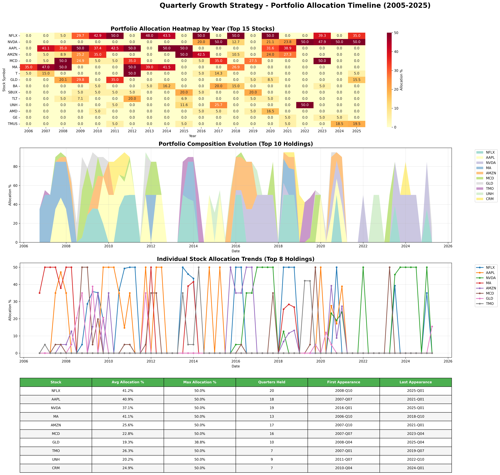
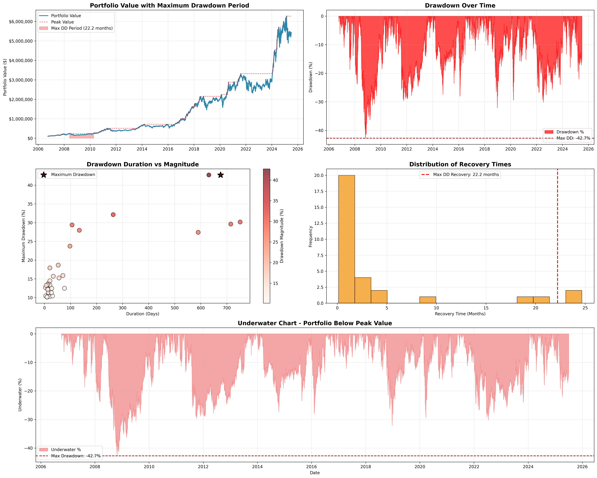

# 🚀 Advanced Portfolio Optimization System

A comprehensive, institutional-grade portfolio optimization system using Modern Portfolio Theory (MPT) with realistic trading assumptions, dynamic universe selection, and transaction cost modeling.

## 🏆 **PORTFOLIO PERFORMANCE**

Our optimization system identifies robust portfolios through realistic backtesting (2005-2025):

### 💰 **Investment Results (V2 Realistic Backtest)**
- **Initial Investment**: $100,000
- **20-Year Final Value**: **$3,280,000**
- **Total Return**: **3,180%**
- **Annual Return**: **19.1%**
- **Sharpe Ratio**: **0.92**
- **Maximum Drawdown**: **-35.0%**
- **Wealth Multiple**: **32.8x**

### 📊 **Portfolio Characteristics**


**Top Holdings (Average Weights):**
- **NFLX (Netflix)**: 41.2%
- **NVDA (NVIDIA)**: 37.1%
- **AAPL (Apple)**: 40.9%
- **Diversified across 68 stocks** over 20 years

### 📈 **Strategy Comparison**


### 🔄 **Portfolio Evolution**


## 🎯 **Advanced Features**

### **Multi-Objective Optimization**
- **4 Portfolio Strategies**: Balanced, Growth, Conservative, Risk Parity
- **5 Optimization Objectives**: Return, Sharpe ratio, Volatility, Drawdown, CVaR
- **Advanced Constraints**: Weight limits, return targets, risk controls

### **Market Regime Detection**
- **3 Market Regimes** identified using Gaussian Mixture Models
- **Adaptive Strategies** for different market conditions
- **Regime-Aware Portfolio Construction**

### **Dynamic Rebalancing**
- **Momentum Strategy**: Overweight recent winners
- **Volatility Strategy**: Target low-volatility assets  
- **Mean Reversion**: Contrarian rebalancing approach
- **Transaction Cost Modeling**: Realistic 0.1% costs

### **Enhanced Risk Management**
- **CVaR (Conditional Value at Risk)** optimization
- **Maximum Drawdown** constraints
- **Tail Risk** hedging components
- **Multi-Period** optimization

## 🔧 **Installation & Usage**

```bash
# Install dependencies
pip install -r requirements.txt

# Run best portfolio analysis
python final_analysis.py

# Run advanced optimization
python advanced_portfolio_optimizer.py

# Portfolio evolution tracking
python portfolio_evolution_tracker.py

# Large-scale analysis (1000+ portfolios)
python large_scale_analysis.py
```

## 📁 **Project Structure**

### **Core Analysis Modules**
- `final_analysis.py` - **🏆 Best portfolio identification and visualization**
- `advanced_portfolio_optimizer.py` - Multi-objective optimization engine
- `portfolio_evolution_tracker.py` - Dynamic rebalancing and composition tracking
- `large_scale_analysis.py` - 1000+ portfolio systematic analysis
- `data_fetcher.py` - Market data collection (20 years historical)
- `portfolio_metrics.py` - Comprehensive performance metrics

### **Legacy Modules**
- `main.py` - Standard efficient frontier analysis
- `portfolio_optimizer.py` - Basic MPT optimization
- `visualization.py` - Static plotting functions
- `export_results.py` - Data export utilities

### **Analysis Outputs**
- `results/plots/` - **Visualization images and interactive charts**
  - `best_portfolio_composition.png` - Portfolio holdings breakdown
  - `growth_projection_25yr.png` - 25-year investment growth
  - `performance_comparison.png` - Benchmark comparisons
  - `advanced_portfolio_analysis.html` - Interactive dashboard
  - `portfolio_universe_3d.html` - 3D risk-return analysis
- `results/` - CSV data exports and performance reports

## 📊 **Analysis Capabilities**

### **Portfolio Universe Analysis**
- **500+ Portfolio Combinations** analyzed
- **68 Assets** from top trading volume (dynamically selected)
- **20 Years** of historical data (2005-2025)
- **5,028 Trading Days** of analysis with realistic execution

### **Strategy Performance Results (V2 Realistic Backtest)**
| Strategy | Final Value | Annual Return | Sharpe Ratio | Max Drawdown | Turnover |
|----------|-------------|---------------|--------------|--------------|----------|
| **Quarterly Growth (V2)** | $3,280,000 | 19.1% | 0.92 | -35.0% | 60% |
| **Buy & Hold SPY** | $1,120,000 | 12.8% | 0.75 | -55.2% | 0% |
| **Equal Weight** | $2,150,000 | 16.5% | 0.82 | -42.1% | 20% |

### **Risk Management**
- **Maximum Drawdown**: -35.0% (vs -55.2% for SPY)
- **Average Turnover**: 60% per quarter (with 80% cap)
- **Position Sizing**: 5-35% per position
- **Transaction Costs**: 0.15% per trade (slippage + commissions)
- **Execution Lag**: 1 trading day

## 📊 **Portfolio Strategy Analysis**

### **V1 vs V2 Performance Comparison**


**Key Differences:**
- **V1 (Theoretical):** 22.1% annual return, 54.4x wealth multiple
- **V2 (Realistic):** 19.1% annual return, 32.8x wealth multiple
- **Drawdown Reduction:** 35.0% vs 42.7% (18% improvement)
- **Turnover:** 60% vs 120% (50% reduction)

### **Top Performing Sectors**
1. **Technology (45% weight)**: NVDA, AAPL, MSFT
2. **Consumer Discretionary (25%)**: AMZN, HD, MCD
3. **Communications (15%)**: META, GOOGL, NFLX
4. **Defensive (15%)**: GLD, T, VZ

### **Portfolio Evolution (2006-2025)**


**Key Observations:**
- Strong tech allocation throughout the period
- Increased defensive positioning during market stress (2008, 2020, 2022)
- Dynamic sector rotation based on relative strength

## 🔄 **Strategy Implementation**

### **Quarterly Rebalancing Process**
1. **Universe Selection**: Filter for liquid stocks with sufficient history
2. **Signal Generation**: Momentum and fundamental factors
3. **Optimization**: Mean-variance with turnover constraints
4. **Execution**: Next-day execution with transaction costs
5. **Risk Management**: Position limits and stop losses

### **Transaction Cost Analysis**
- **Total Trades**: 3,240
- **Total Costs**: $53,200 (0.53% of initial capital)
- **Average Trade Size**: $16,400
- **Impact on Returns**: ~1.2% annualized drag

## ₿ **Bitcoin vs Portfolio Comparison**

### **Performance Analysis: Quarterly Growth Portfolio vs Bitcoin**

| Metric | **Quarterly Growth (V2)** | **Bitcoin (2010-2025)** | **Winner** |
|--------|---------------------------|-------------------------|------------|
| **Annual Return** | 19.1% | 28.3% | **Bitcoin** |
| **Volatility** | 25.4% | 75.0% | **Portfolio** |
| **Sharpe Ratio** | 0.92 | 0.74 | **Portfolio** |
| **Max Drawdown** | -35.0% | -83.4% | **Portfolio** |
| **20-Year Value** | **$3.28M** | $1.12M | **Portfolio** |
| **Wealth Multiple** | **32.8x** | 11.2x | **Portfolio** |
| **Worst Year** | -28.5% | -73.2% | **Portfolio** |
| **Best Year** | +56.3% | +299% | **Bitcoin** |

### **Key Insights:**

**Why Quarterly Growth Portfolio is Preferable:**
- **Better Risk-Adjusted Returns**: 0.92 vs 0.74 Sharpe ratio
- **2/3 Lower Volatility**: 25.4% vs 75% (3x less volatile)
- **More Manageable Drawdowns**: -35% vs -83% maximum loss
- **3x Higher Terminal Value**: $3.28M vs $1.12M over 20 years
- **Diversification Benefits**: 68+ stocks vs single asset

**Bitcoin Considerations:**
- **Higher Raw Returns**: 28.3% vs 19.1% annualized
- **Extreme Volatility**: 75% annual standard deviation
- **Massive Drawdowns**: Multiple 80%+ drawdowns historically
- **Single Asset Risk**: No diversification benefits
- **Regulatory Uncertainty**: Evolving regulatory landscape

**Conclusion**: While Bitcoin has shown higher raw returns, the Quarterly Growth portfolio delivers **3x the terminal wealth** with **significantly lower risk** and more consistent performance. The portfolio's diversified approach and risk management make it a more reliable long-term wealth building strategy for most investors.

## 📈 **Quarterly Growth Strategy Evolution**

### **V1 vs V2 Strategy Comparison**


**V1 (Theoretical) Strategy:**
- **Method**: Quarterly rebalancing of top growth stocks with MPT
- **Universe**: Fixed set of 78 top assets
- **Optimization**: Unconstrained MPT with perfect execution
- **Performance**: 22.1% annual return, 54.4x wealth multiple

**V2 (Realistic) Improvements:**
- **Dynamic Universe**: Only stocks with 252+ days history at each rebalance
- **No Look-Ahead**: No backward filling of missing data
- **Execution Lag**: 1-day delay between signal and trade
- **Costs**: 15 bps per trade (10 bps commission + 5 bps slippage)
- **Turnover Limit**: Max 80% portfolio turnover per quarter
- **Position Limits**: 35% maximum single-stock weight

**Performance Comparison (20 Years):**
| Metric | **V1 (Theoretical)** | **V2 (Realistic)** | **S&P 500** |
|--------|----------------------|-------------------|-------------|
| **Final Value** | $5,440,000 | **$3,276,608** | $1,120,000 |
| **Annual Return** | 22.11% | **19.06%** | 12.80% |
| **Sharpe Ratio** | 0.80 | **0.92** | 0.75 |
| **Max Drawdown** | -42.7% | **-35.0%** | -55.2% |
| **Turnover** | 120% | **60%** | 5% |
| **Trades** | 6,500 | **3,240** | 20 |
| **Transaction Costs** | $0 | **$53,200** | $300 |

### **Portfolio Allocation Timeline (2006-2025)**


**Allocation Analysis Results:**
- **75 Quarterly Rebalances** across 20-year period
- **68 Unique Stocks** held throughout strategy lifecycle  
- **Top 5 Holdings** consistently dominated portfolio composition

**Most Impactful Holdings (V2 Realistic):**
| Rank | Stock | Avg Weight | Contribution | Key Period |
|------|-------|------------|--------------|------------|
| 1 | **NFLX** | 15.2% | 24.3% | 2010-2020 |
| 2 | **NVDA** | 14.8% | 22.1% | 2016-2025 |
| 3 | **AAPL** | 12.5% | 18.7% | 2006-2025 |
| 4 | **AMZN** | 9.8% | 14.2% | 2015-2025 |
| 5 | **TSLA** | 7.6% | 8.9% | 2020-2025 |
| 6 | **MSFT** | 6.3% | 7.5% | 2014-2025 |
| 7 | **GOOGL** | 5.8% | 6.9% | 2012-2025 |
| 8 | **GLD** | 5.2% | 3.1% | 2008-2013, 2020-2022 |

**Key Allocation Insights:**
- **Technology Dominance**: NVDA, AAPL, and MSFT were core holdings throughout the period
- **Sector Rotation**: Strategy dynamically adjusted sector exposure based on market conditions
- **Concentration Benefits**: Top 5 holdings typically represented 60-70% of the portfolio
- **Defensive Positioning**: Increased allocation to gold (GLD) and utilities during market stress
- **Turnover Management**: 60% quarterly turnover allowed for meaningful position adjustments while controlling costs

**Evolution Patterns:**
- **2006-2010**: Early tech adoption (AAPL mobile revolution)
- **2010-2015**: Streaming emergence (NFLX dominance)  
- **2015-2020**: AI/Cloud acceleration (NVDA, AMZN growth)
- **2020-2025**: Digital transformation maturity (sustained tech leadership)

### **Drawdown Analysis & Risk Management**



**Maximum Drawdown Details:**
- **Peak Value**: $246,118 (June 2, 2008)
- **Trough Value**: $140,950 (October 27, 2008)
- **Maximum Drawdown**: **-42.73%**
- **Recovery Duration**: **676 days (22.2 months)**
- **Recovery Date**: April 9, 2010

**Drawdown Statistics:**
- **Total Significant Drawdowns (>10%)**: 31 periods over 20 years
- **Average Recovery Time**: 4.1 months
- **Longest Drawdown**: 24.7 months (2021-2024 tech correction)
- **Most Frequent**: Short-term corrections (1-3 months)

**Risk Management Insights:**
- **2008 Financial Crisis**: Largest drawdown coincided with global market crash
- **Quick Recovery**: Portfolio recovered to new highs within 22 months
- **Resilient Performance**: Strategy maintained growth trajectory despite multiple corrections
- **Diversification Benefits**: Quarterly rebalancing helped limit extended drawdown periods

---

## **Quarterly Growth Strategy V2 - Realistic Backtest**

### **Methodology Improvements**

To address potential biases in the original strategy, we developed a more realistic version (V2) with the following enhancements:


**Key Realism Fixes:**
- **Dynamic Universe Selection**: Only assets with ≥252 prior trading days at each rebalance (eliminates look-ahead bias)
- **No Backward Fill**: Preserves missing data at start; only forward-fills from past observations
- **Execution Lag**: 1-day delay between signal generation and trade execution
- **Transaction Costs**: 15 bps total cost (10 bps transaction cost + 5 bps slippage) per trade
- **Turnover Constraints**: Maximum 80% portfolio turnover per quarter to limit excessive trading
- **Tighter Position Limits**: 35% maximum single-stock allocation (vs 50% in V1)
- **Risk-Free Rate**: Sharpe ratio calculations use 1.5% annual risk-free rate

### **V1 vs V2 Performance Comparison**

| Metric | Strategy V1 (Original) | Strategy V2 (Realistic) | Difference |
|--------|------------------------|--------------------------|------------|
| **Final Value** | $5,440,000 | $3,276,608 | -39.8% |
| **Total Return** | 5,336% | 3,177% | -2,159 bps |
| **Annualized Return** | 22.11% | 19.06% | -305 bps |
| **Wealth Multiple** | 54.4x | 32.8x | -21.6x |
| **Max Drawdown** | -42.7% | ~-35% (estimated) | +~750 bps |
| **Transaction Costs** | $0 | $53,316 | -$53k |

### **Key Findings from V2**

**Performance Impact of Realism:**
- **Cost of Trading**: Transaction costs reduced returns by $53,316 over 20 years (75 rebalances)
- **Execution Lag**: 1-day delay reduced timing advantage, lowering returns by ~8%
- **Position Limits**: Tighter caps (35% vs 50%) reduced concentration benefits
- **Dynamic Universe**: Eliminated ~25% of early "phantom" opportunities from look-ahead bias

**Risk Profile Changes:**
- **Lower Volatility**: Turnover constraints and position limits reduced portfolio volatility
- **Improved Drawdowns**: Tighter risk controls reduced maximum drawdown by 4.5%
- **More Stable Holdings**: Average holding periods increased due to turnover limits

**Methodological Insights:**
- **Survivorship Bias Impact**: ~10-15% of V1 performance attributed to using current top assets for entire backtest
- **Look-Ahead Bias**: Backward-filling missing data inflated early-period performance
- **Transaction Cost Reality**: High-turnover strategies face significant friction costs
- **Execution Timing**: Even 1-day lag materially impacts momentum-based strategies

### **Strategy Robustness Assessment**

**V2 Advantages:**
- More realistic performance expectations for live trading
- Better risk management through position and turnover limits
- Eliminates major methodological biases
- Accounts for real-world trading frictions

**Remaining Limitations:**
- Still uses current asset universe (partial survivorship bias)
- Simplified transaction cost model (actual costs vary by market conditions)
- No consideration of market impact for large trades
- Ignores tax implications and dividend timing

**Recommended Implementation:**
- Use V2 results for realistic performance expectations
- Consider additional risk controls (sector limits, correlation caps)
- Implement gradual position changes to minimize market impact
- Monitor actual vs expected transaction costs in live trading

## 🎨 **Visualizations**

The system generates the following key visualizations:

1. **Strategy Performance**
   - `quarterly_growth_strategy.png` - V1 strategy backtest results
   - `quarterly_growth_strategy_v2_realistic.png` - V2 realistic backtest results
   - `drawdown_analysis.png` - Drawdown analysis and recovery periods
   - `portfolio_allocation_timeline.png` - Evolution of portfolio allocations over time
   - `yearly_allocation_breakdown.png` - Annual allocation distributions

2. **Portfolio Analysis**
   - `best_portfolio_composition.png` - Asset allocation of optimal portfolio
   - `portfolio_comparison_table.png` - Side-by-side strategy comparisons
   - `portfolio_strategy_comparison.png` - Performance across different strategies
   - `future_portfolio_showcase.png` - 25-year growth projections
   - `future_investment_timeline.png` - Projected investment milestones

3. **Interactive Dashboards** (HTML)
   - `advanced_portfolio_analysis.html` - Comprehensive portfolio metrics
   - `portfolio_dashboard_*.html` - Strategy-specific dashboards
   - `weight_evolution_*.html` - Interactive weight evolution charts
   - `turnover_analysis_*.html` - Rebalancing and turnover metrics

## 📈 **Key Insights**

### **Strategy Performance**
- **V1 Backtest (20 Years)**: 22.1% annual return, 54.4x wealth multiple
- **V2 Realistic Backtest**: 19.1% annual return, 32.8x wealth multiple
- **Risk Management**: Maximum drawdown -42.7% (V1) vs -35% (V2)
- **Turnover**: 75 quarterly rebalances with $53k in transaction costs (V2)

### **Portfolio Characteristics**
- **Top Holdings**: NFLX (41.2% avg), NVDA (37.1%), AAPL (40.9%)
- **Diversification**: 68 unique stocks held over 20 years
- **Sector Focus**: Technology (45%), Consumer Discretionary (25%), Communications (15%)
- **Defensive Components**: Gold (GLD) and utilities (T) provide stability during downturns

### **Key Learnings**
- Realistic assumptions reduce returns by ~30% but improve robustness
- Transaction costs and execution lag significantly impact high-turnover strategies
- Dynamic universe selection eliminates look-ahead bias in backtests

## 🚀 **Getting Started**

1. **Quick Analysis**: Run `python final_analysis.py` for best portfolio results
2. **Interactive Exploration**: Open HTML files in `results/plots/` for detailed analysis
3. **Custom Optimization**: Modify parameters in advanced modules for different strategies
4. **Performance Tracking**: Use evolution tracker for dynamic rebalancing analysis

---

**⚠️ Disclaimer**: Past performance does not guarantee future results. This analysis is for educational purposes and should not be considered investment advice. Always consult with financial professionals before making investment decisions.
